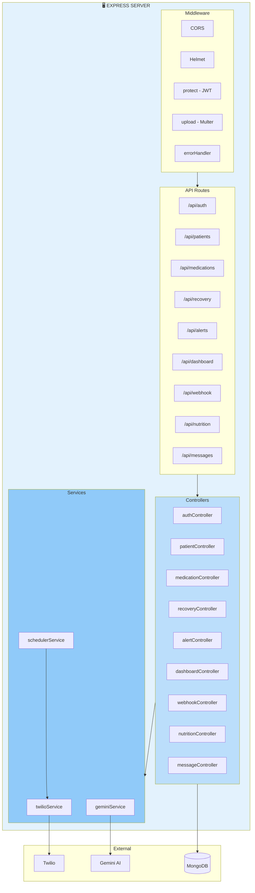
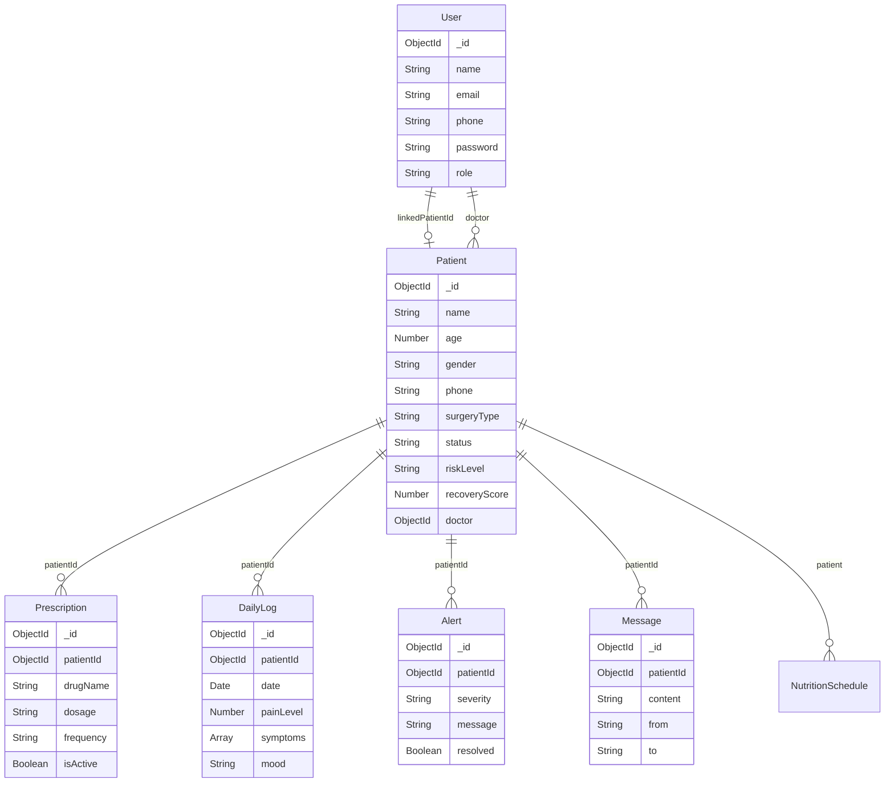
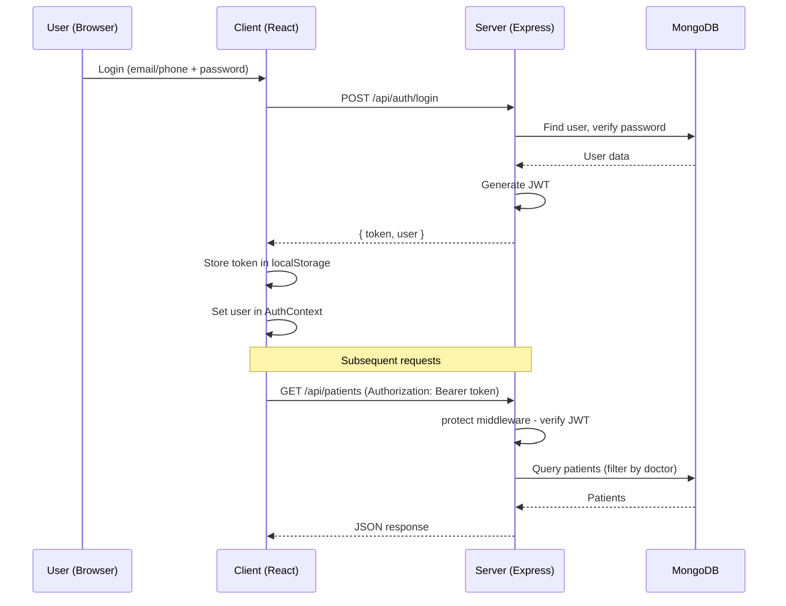
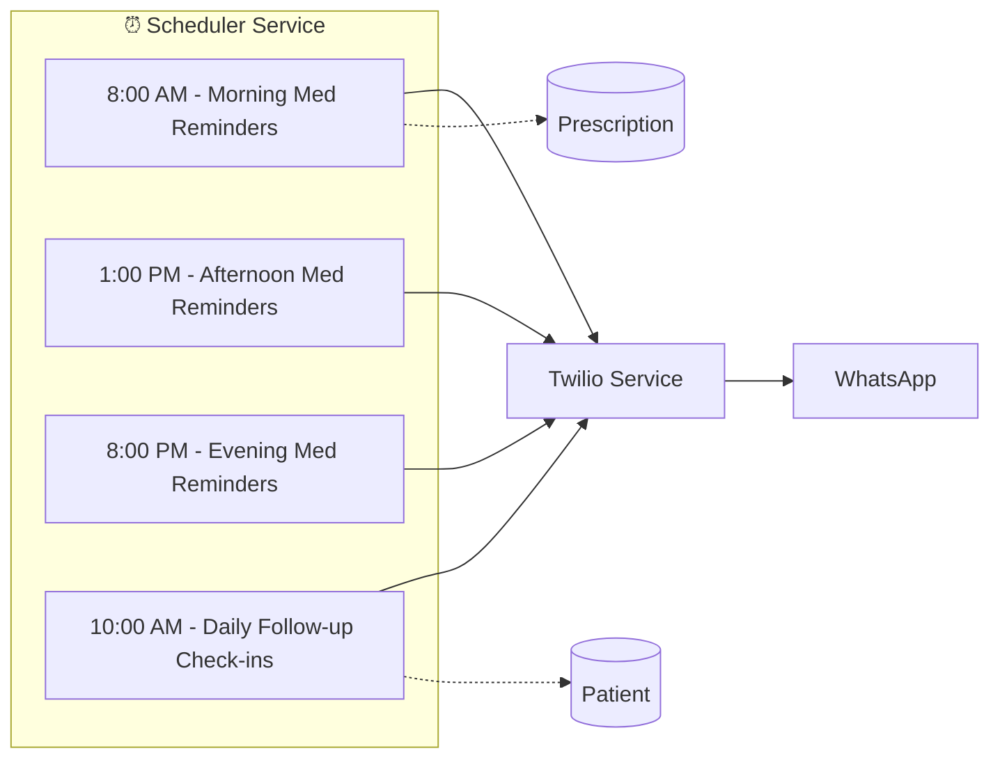

# PostCare AI — System Architecture

> **Autonomous Patient Follow-up Agent for Doctors**  
> A full-stack healthcare management platform with AI-powered messaging and automated follow-ups.

---

## 1. High-Level System Overview

```
┌─────────────────────────────────────────────────────────────────────────────────────────┐
│                           POSTCARE AI — SYSTEM ARCHITECTURE                               │
└─────────────────────────────────────────────────────────────────────────────────────────┘

    ┌──────────────┐         ┌──────────────────┐         ┌──────────────────────────────┐
    │   DOCTORS    │         │     PATIENTS     │         │   EXTERNAL INTEGRATIONS      │
    │   (Web UI)   │         │  (Web + WhatsApp) │         │                             │
    └──────┬───────┘         └────────┬─────────┘         └──────────────┬───────────────┘
           │                          │                                  │
           │    HTTPS / REST API      │    WhatsApp Webhook              │
           ▼                          ▼                                  ▼
    ┌──────────────────────────────────────────────────────────────────────────────────┐
    │                        EXPRESS.JS API SERVER (Port 5000/5050)                      │
    │  ┌─────────────┐  ┌─────────────┐  ┌─────────────┐  ┌─────────────────────────┐  │
    │  │   Auth      │  │  Patients   │  │  Dashboard  │  │  Messages / AI Chat     │  │
    │  │   JWT       │  │  CRUD       │  │  Stats       │  │  Gemini AI              │  │
    │  └─────────────┘  └─────────────┘  └─────────────┘  └─────────────────────────┘  │
    └───────────────────────────────────────────┬────────────────────────────────────────┘
                                                │
           ┌────────────────────────────────────┼────────────────────────────────────┐
           ▼                                    ▼                                        ▼
    ┌──────────────┐                    ┌──────────────┐                    ┌──────────────┐
    │   MONGODB    │                    │   TWILIO     │                    │   GEMINI AI  │
    │   Atlas      │                    │   WhatsApp   │                    │   (Google)   │
    └──────────────┘                    └──────────────┘                    └──────────────┘
```

---

## 2. Client-Side Architecture (React + Vite)

```mermaid
flowchart TB
    subgraph CLIENT["🖥️ CLIENT (Vite + React)"]
        subgraph PROVIDERS["Context Providers"]
            TP[ThemeProvider]
            AP[AuthProvider]
        end
        
        subgraph ROUTING["React Router"]
            PR[ProtectedRoute]
            DL[DashboardLayout]
        end
        
        subgraph PAGES["Pages"]
            LP[LoginPage]
            RP[RegisterPage]
            PRP[PatientRegisterPage]
            DP[DashboardPage]
            PP[PatientsPage]
            PDF[PatientDetailPage]
            PFP[PatientFormPage]
            PMP[PatientMapPage]
            AP2[AlertsPage]
            ANP[AnalyticsPage]
            MRP[MyRecoveryPage]
            MSP[MessagesPage]
        end
        
        subgraph SERVICES["Services"]
            API[api.js - Axios]
            PS[patientService.js]
        end
        
        PROVIDERS --> ROUTING
        ROUTING --> PAGES
        PAGES --> SERVICES
        API --> |"JWT Bearer"| SERVER
    end
    
    subgraph SERVER["Express API"]
        API_SERVER[localhost:5000/api]
    end
    
    style CLIENT fill:#e8f5e9
    style PROVIDERS fill:#c8e6c9
    style PAGES fill:#a5d6a7
    style SERVICES fill:#81c784
```



---

## 3. Server-Side Architecture (Express.js)



---

## 4. API Endpoints Map

| Module | Method | Endpoint | Description |
|--------|--------|----------|-------------|
| **Auth** | POST | `/api/auth/login` | Doctor/Patient login |
| | POST | `/api/auth/register` | Doctor registration |
| | POST | `/api/auth/register/patient` | Patient registration |
| | GET | `/api/auth/me` | Get current user (protected) |
| | PUT | `/api/auth/me` | Update profile |
| **Patients** | GET | `/api/patients` | List patients |
| | POST | `/api/patients` | Create patient |
| | GET | `/api/patients/:id` | Get patient detail |
| | PUT | `/api/patients/:id` | Update patient |
| | DELETE | `/api/patients/:id` | Delete patient |
| | POST | `/api/patients/:id/prescription` | Upload prescription |
| | POST | `/api/patients/:id/emergency` | Send emergency alert |
| **Medications** | GET | `/api/medications/:patientId` | Get medications |
| | POST | `/api/medications` | Add medication |
| | POST | `/api/medications/bulk` | Bulk add |
| **Recovery** | POST | `/api/recovery/:patientId/log` | Add daily log |
| | GET | `/api/recovery/:patientId/logs` | Get recovery logs |
| **Alerts** | GET | `/api/alerts` | List alerts |
| | GET | `/api/alerts/stats` | Alert statistics |
| | PUT | `/api/alerts/:id/resolve` | Resolve alert |
| **Dashboard** | GET | `/api/dashboard/stats` | Dashboard stats |
| **Messages** | GET | `/api/messages?patientId=` | Get chat history |
| | POST | `/api/messages` | Send message |
| | POST | `/api/messages/agent` | AI chat (Gemini) |
| **Webhook** | POST | `/api/webhook/whatsapp` | Twilio WhatsApp webhook |
| **Nutrition** | GET/POST | `/api/nutrition` | Nutrition schedules |

---

## 5. Data Model (MongoDB)



---

## 6. Authentication & Authorization Flow



---

## 7. Background Jobs (Cron Scheduler)



---

## 8. Technology Stack Summary

| Layer | Technology |
|-------|------------|
| **Frontend** | React 18, Vite 7, React Router 6, Framer Motion, Recharts, React Hot Toast, Axios |
| **Backend** | Node.js, Express.js |
| **Database** | MongoDB (Mongoose ODM) |
| **Auth** | JWT (JSON Web Tokens) |
| **AI** | Google Gemini 1.5 Flash |
| **Messaging** | Twilio WhatsApp API |
| **Scheduling** | node-cron |
| **File Upload** | Multer |
| **Maps** | Leaflet, OpenStreetMap |

---

## 9. Directory Structure

```
PostCareAi/
├── client/                 # React frontend
│   ├── src/
│   │   ├── context/        # AuthContext, ThemeContext
│   │   ├── hooks/          # useFetch
│   │   ├── layouts/        # DashboardLayout
│   │   ├── pages/          # 12 page components
│   │   ├── routes/         # ProtectedRoute
│   │   ├── services/       # api.js, patientService.js
│   │   ├── App.jsx
│   │   └── main.jsx
│   └── vite.config.js
│
├── server/                  # Express backend
│   ├── config/             # db.js, constants.js
│   ├── controllers/        # 9 controllers
│   ├── middleware/         # auth, errorHandler, upload
│   ├── models/             # User, Patient, Prescription, etc.
│   ├── routes/             # 9 route modules
│   ├── services/           # twilio, gemini, scheduler
│   ├── scripts/            # seed.js
│   └── server.js
│
└── docs/
    ├── ARCHITECTURE_DIAGRAM.md
    └── MONGODB_SCHEMA.md
```

---

*Generated for PostCare AI — Autonomous Patient Follow-up Agent*
